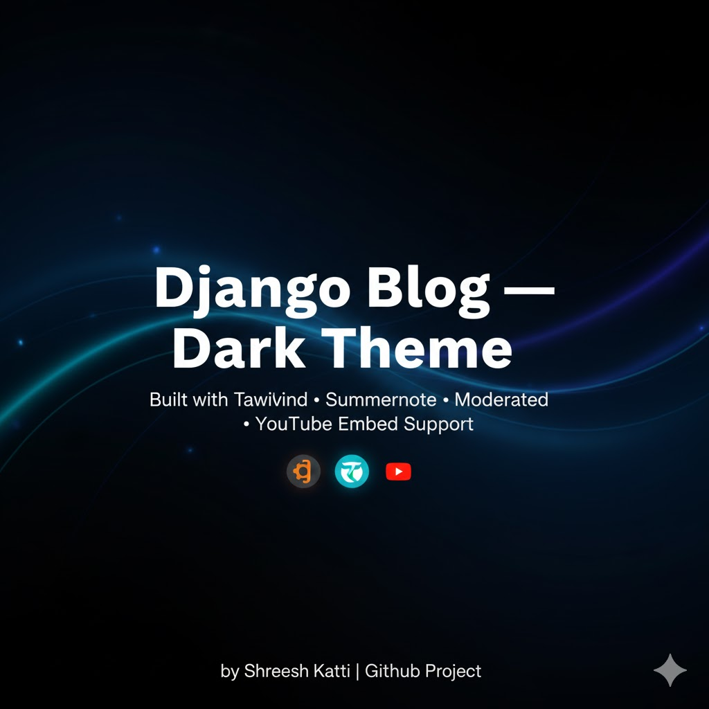

  

<h1 align="center"> Django Blog — Dark Pro Theme </h1>

  
  
  

A professional, dark-themed Django blog project featuring modern design, interactive UI, and rich editing experience.

---

)
🧰 Tech Stack
🖥️ Frontend

🎨 Tailwind CSS — sleek, modern, fully responsive dark UI

💡 HTML5 + CSS3 — template rendering and structure

🌙 Custom animations using Tailwind utilities

⚙️ Backend

🧠 Django 5.x — routing, ORM, class-based views

🐍 Python 3.11+ — core programming language

💬 Django Forms — handles validated user comments and input

🗄️ Database

🪶 SQLite (development) — simple, file-based DB

🧱 Ready for PostgreSQL / MySQL in production

📝 Rich Text Editor

✍️ django-summernote — embeds videos, images, and formatted text

🧩 Tools & Workflow

🔑 Git & GitHub — version control and collaboration

🧱 Virtual Environment (venv) — dependency isolation

💻 Git Bash — professional CLI workflow on Windows

mysite/
│
├── blog/
│   ├── templates/blog/
│   │   ├── base.html
│   │   ├── index.html
│   │   ├── post_detail.html
│   │   └── sidebar.html
│   ├── admin.py
│   ├── forms.py
│   ├── models.py
│   ├── urls.py
│   └── views.py
│
├── mysite/
│   ├── settings.py
│   ├── urls.py
│   └── wsgi.py
│
├── db.sqlite3
├── manage.py
├── requirements.txt
├── LICENSE
└── README.md

